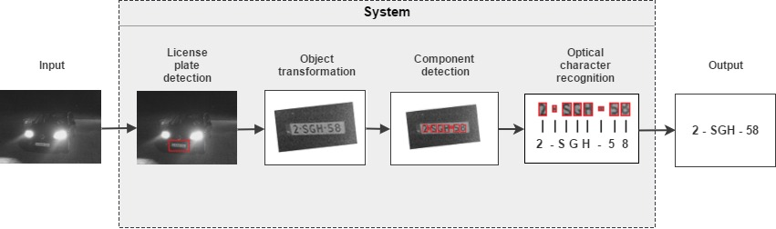

# ComputerVision

For our Computer Vision Project we have built a license plate recognizer. The system takes
an image as input, checks whether it contains a license plate, and
if it does, identifies and classifies the characters from that license plate. 
To achieve this, three main components are integrated:
1. License plate detection: Identifies which part of the image, if any, depicts the license plate
and extracts it. To do so we implemented a variation of Dalal-Trigg's object detector, using a non-linear SVM instead of a linear one. Where the features used to do so, are the traditional HOG features.
2. Character segmentation: Identifies the individual characters in the detected segments. We first cropped each license plate segment to a license plate without background. The characters were extracted afterwards. Both subcomponents use contours of the objects in an image to identify whether it is a license plate or characters respectively.
3. Optical character recognition: Classify each character segment to identify which character
(A-Z, 0-9) is depicted. We implemented this component using a 3-layered Convolutional Neural Network.

Once the system has classified each individual character we concatenated all the character labels
to get the desired output. Figure 1 shows the resulting pipeline of this system.

*Figure 1: Overview of our system's pipeline*

Each system component is written in Pyton, where we used several packages as listed in table 1.

| Commponent             | Package       | 
| ---------------------- |:-------------:| 
| General                |Scikit-learn, scikit-image |
| Detection              | HOG features  | 
| Segmentation           | OpenCV 3.0.0  | 
| Charachter recognition | TensorFlow    | 

*Table 1: Overview of used packages and frameworks*

