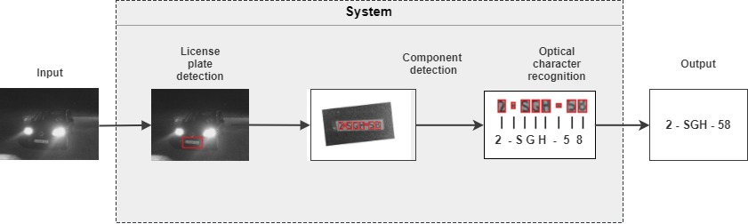

# License Plate Recognition

For our IN4393 Computer Vision project we have built a license plate recognizer. The system takes
an image as input, checks whether it contains a license plate, and
if it does, identifies and classifies the characters from that license plate. 
To achieve this, three main components are integrated:
1. License plate detection: Identifies which part of the image, if any, depicts the license plate
and extracts it. To do so we implemented a variation of Dalal-Trigg's object detector, using HOG features to represent the input images and a linear SVM for classification.
2. Character segmentation: Extracts the individual characters from the detected segments. We first cropped each license plate segment to remove the surrounding background. The characters were extracted afterwards. Both subcomponents use contours of the objects in an image to identify whether it is a license plate or characters, respectively.
3. Optical character recognition: Classify each individual character image to identify which character
(A-Z, 0-9) is depicted. We implemented this component using a 3-layered Convolutional Neural Network.

Once the system has classified each individual character we concatenated all the character labels
to get the desired output. Figure 1 shows the resulting pipeline of this system.

*Figure 1: Overview of our system's pipeline*

### Instructions to execute system

1. Clone this repository 
2. Run the `Main.py` file (input images automatically imported)
3. Resulting classifications can be found in the `results.txt` file in the root (while running we also print progress updates in the console)

In `results.txt`, each line contains the predicted text for the license plate in the corresponding image (i.e. the first line contains the prediction of image_0001.jpg). The images that we test on are located in the `datasets/cars_markus` directory. For the correct labels of each license plate in these images, please see the `labels.txt` file (which follows the same structure). Here we used "IRREGULAR" to denote a license plate that was in some way ill-suited for our classification task (because part of the plate was obscured, or because it contained highly irregular license plates such as "NEW CENTURY").

### Overview of used packages and frameworks

Each system component is written in Pyton, where we used several packages as listed in Table 1.

| Component              | Package                          | Third-party algorithms used
| ---------------------- |:--------------------------------:|:--------------------------------------------
| General                |Scikit-learn, scikit-image, numpy | 
| Detection              | -                                | We used skimage.feature.hog() to extract HOG features and sklearn.svm.SVC() for our SVM classifier. The remaining functionalities, such as the sliding window technique and the averaging of the positive matches, we did ourselves.
| Segmentation           | OpenCV                           | We used the `cv2.findContours()` function to extract contours from the images. Some additional functions are used to preprocess the images. 
| Charachter recognition | TensorFlow                       | We used Tensorflow's built-in functions as the building blocks to our CNN (e.g. by defining the individual layers, the optimization procedure and loss function). Other tasks such as fine-tuning the network, setting up the training and testing procedure, etc. were all things we implemented ourselves.

*Table 1: Overview of used packages and frameworks*

